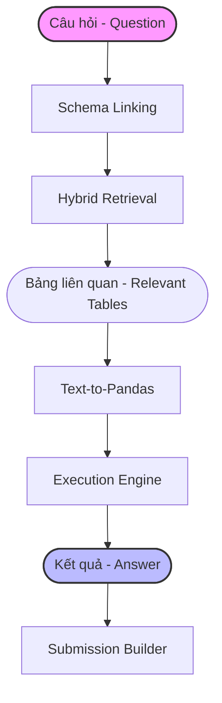
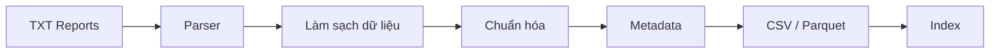
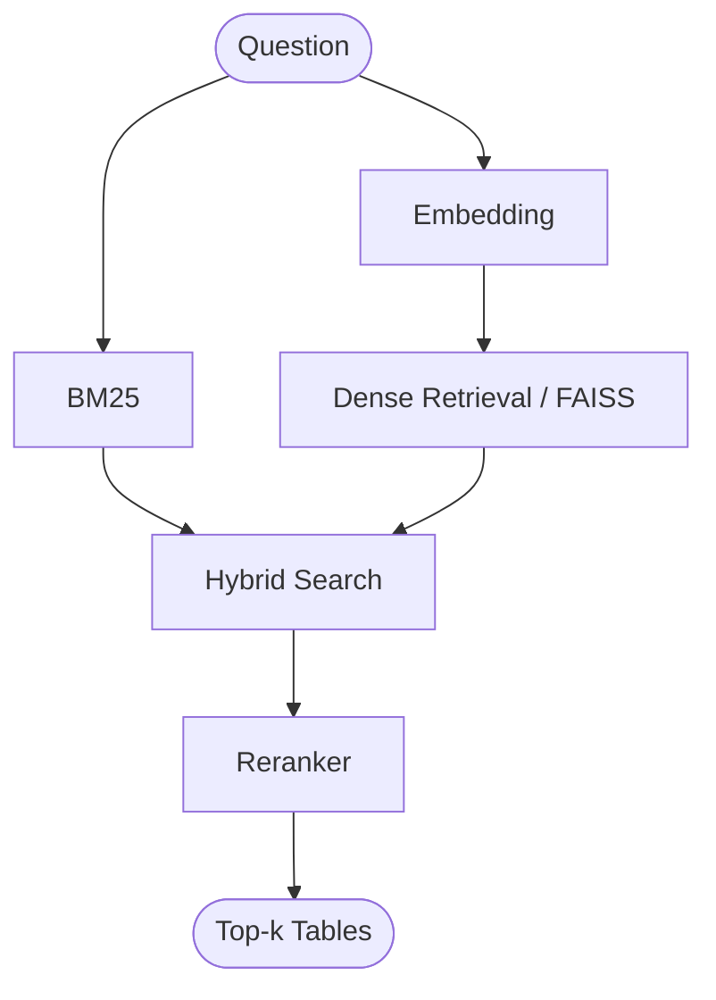
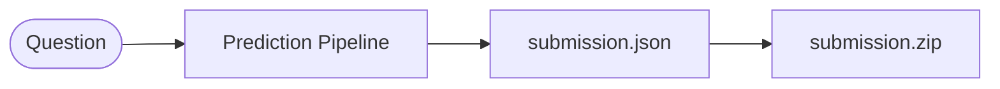

<div align="center">
  
  <h1>NewGenAI Financial Agent</h1>
  <p><strong>Hệ thống AI Agent Dành Cho Truy Vấn & Trích Xuất Dữ Liệu Tài Chính Tiếng Việt</strong></p>
  <p>
    <a href="#"></a>
    <a href="#"></a>
    <a href="#"></a>
    <a href="#"></a>
    <a href="https://github.com/astral-sh/ruff"></a>
    <a href="https://github.com/psf/black"></a>
  </p>
</div>

<br>

## 📑 Mục lục
1. [Giới thiệu dự án](#-1-giới-thiệu-dự-án)
2. [Tổng quan cuộc thi](#-2-tổng-quan-cuộc-thi)
3. [Kiến trúc hệ thống](#-3-kiến-trúc-hệ-thống)
4. [Công nghệ sử dụng](#-4-công-nghệ-sử-dụng)
5. [Cấu trúc thư mục](#-5-cấu-trúc-thư-mục)
6. [Giải thích các module trong src](#-6-giải-thích-các-module-trong-src)
7. [Pipeline xử lý dữ liệu](#-7-pipeline-xử-lý-dữ-liệu)
8. [Pipeline Retrieval](#-8-pipeline-retrieval)
9. [Pipeline Text-to-Pandas](#-9-pipeline-text-to-pandas)
10. [Pipeline Submission](#-10-pipeline-submission)
11. [Lộ trình phát triển](#-11-lộ-trình-phát-triển)
12. [Quy chuẩn code](#-12-quy-chuẩn-code)
13. [Checklist phát triển](#-13-checklist-phát-triển)
14. [Định hướng phát triển](#-14-định-hướng-phát-triển)
15. [Thành viên nhóm](#-15-thành-viên-nhóm)
16. [Giấy phép](#-16-giấy-phép)
17. [Tài liệu tham khảo](#-17-tài-liệu-tham-khảo)

---

## 📖 1. Giới thiệu dự án

**NewGenAI Financial Agent** là giải pháp hệ thống AI Agent do nhóm **NewGenAI** nghiên cứu và phát triển để tham gia cuộc thi **AI Guru 2026**. Mục tiêu của dự án là xây dựng một hệ thống Trí tuệ Nhân tạo tinh vi có khả năng tự động hóa việc phân tích và giải đáp các câu hỏi nghiệp vụ dựa trên hàng ngàn báo cáo tài chính.

**Sự khác biệt cốt lõi:** Hệ thống này được thiết kế là một **Financial AI Agent** thay vì một chatbot thông thường.
- **Chatbot** chỉ đơn thuần xử lý văn bản, có xu hướng tự "bịa" dữ liệu (hallucination) khi gặp câu hỏi tài chính yêu cầu độ chính xác tuyệt đối.
- **AI Agent** của chúng tôi hoạt động độc lập: hiểu câu hỏi, tự động truy hồi dữ liệu chính xác, tự suy luận ra cấu trúc bảng, **viết mã lập trình (Pandas)**, **thực thi mã đó** trong môi trường cô lập, và trả về kết quả số học chính xác tuyệt đối kèm theo dẫn nguồn (evidence).

Dự án được xây dựng với tư duy **production-ready**, sẵn sàng đóng gói, mở rộng và bảo trì dài hạn, hướng tới việc trở thành một framework AI mã nguồn mở tiên phong trong lĩnh vực tài chính sau cuộc thi.

---

## 🏆 2. Tổng quan cuộc thi

**AI Guru 2026** đặt ra một bài toán đầy thách thức: Trích xuất và suy luận trên dữ liệu bảng (Financial Table Retrieval & Text-to-Pandas) đối với Báo cáo tài chính Việt Nam.

**Đầu vào (Input):**
- Danh sách các câu hỏi tài chính phức tạp bằng tiếng Việt.
- Kho dữ liệu Báo cáo tài chính thô, chưa có cấu trúc, định dạng TXT.

**Đầu ra (Output) yêu cầu của hệ thống:**
- `answer`: Kết quả cuối cùng chính xác của phép tính / câu hỏi.
- `relevant_docs`: Tài liệu TXT chứa thông tin trả lời.
- `relevant_tables`: Các bảng dữ liệu liên quan được trích xuất.
- `evidence`: Dẫn chứng trực tiếp từ tài liệu.
- `pandas_query`: Đoạn mã Pandas tạo ra kết quả.

---

## 🏗️ 3. Kiến trúc hệ thống

Hệ thống được thiết kế theo hướng pipeline nối tiếp, phân chia nhiệm vụ rõ ràng cho từng Agent và Module.



**Giải thích các thành phần chính:**
1. **Schema Linking**: Phân tích câu hỏi và liên kết từ khóa ngữ nghĩa với cấu trúc cột/hàng dự kiến.
2. **Hybrid Retrieval**: Kết hợp tìm kiếm từ khóa và vector để truy hồi bảng.
3. **Text-to-Pandas**: Sử dụng LLM để dịch ngôn ngữ tự nhiên thành mã lệnh.
4. **Execution Engine**: Môi trường an toàn (sandbox) để chạy mã.
5. **Submission Builder**: Đóng gói các thông tin đầu ra theo chuẩn yêu cầu.

---

## 🛠️ 4. Công nghệ sử dụng

Chúng tôi lựa chọn các công nghệ hiện đại, tối ưu tốc độ và dễ dàng triển khai:

| Nhóm | Công nghệ | Mục đích / Giải thích |
| :--- | :--- | :--- |
| **Backend** | Python, FastAPI, Uvicorn, Pydantic | Xây dựng REST API tốc độ cao, xác thực dữ liệu chặt chẽ. |
| **AI / LLM** | HuggingFace Transformers, Qwen3-8B-Instruct, BGE-M3, BGE Reranker | Lõi AI xử lý ngôn ngữ, sinh mã và nhúng vector đa ngữ. |
| **Retrieval** | FAISS, BM25 | Xây dựng index hỗn hợp (Sparse + Dense) tìm kiếm tốc độ cao. |
| **Data Processing**| Pandas, DuckDB, PyArrow | Phân tích dữ liệu, xử lý bảng và tính toán bộ nhớ cực nhanh. |
| **Development** | Ruff, Black, MyPy, Pytest | Linter cực nhanh, định dạng chuẩn, type check tĩnh, test. |
| **Container** | Docker, Docker Compose | Đóng gói môi trường, ảo hóa sandbox để chạy code an toàn. |

---

## 📁 5. Cấu trúc thư mục

```text
finagent/
├── configs/          # File cấu hình (YAML/JSON) cho mô hình, đường dẫn, hyper-parameters.
├── data/             # Kho chứa dữ liệu thô (TXT) và dữ liệu đã qua xử lý (CSV/Parquet).
├── docs/             # Tài liệu thiết kế kiến trúc, API, hướng dẫn nội bộ.
├── experiments/      # Các sổ tay Jupyter Notebook dùng để R&D, EDA và test ý tưởng.
├── models/           # Nơi lưu trữ local weights của mô hình (tránh tải lại nhiều lần).
├── outputs/          # Kết quả chạy thử, log lỗi, các file submission được tạo ra.
├── scripts/          # Bash shell hoặc Python scripts cho CI/CD, chuẩn bị môi trường.
├── src/              # Mã nguồn chính của dự án. Chứa toàn bộ logic lõi.
├── tests/            # Bộ kiểm thử (Unit test, Integration test).
├── Dockerfile        # Khai báo container.
├── docker-compose.yml# Khai báo các dịch vụ container.
├── pyproject.toml    # Quản lý dependency và cấu hình công cụ (Ruff, Black, MyPy).
└── README.md         # File bạn đang đọc.
```

---

## 🧠 6. Giải thích các module trong `src`

Thiết kế của thư mục `src` tuân thủ nguyên tắc Single Responsibility Principle (SRP):

- `api`: Xử lý HTTP Request/Response, định nghĩa routes FastAPI.
- `core`: Chứa cấu hình cốt lõi, logging config, và các hằng số.
- `preprocessing`: Logic làm sạch, chuẩn hóa tiền tệ, xử lý nhiễu từ văn bản thô.
- `metadata`: Trích xuất năm, quý, đơn vị tiền tệ từ báo cáo; làm giàu thông tin cho bảng.
- `indexing`: Quản lý việc tạo, lưu và tải FAISS / BM25 index.
- `schema_linking`: Ánh xạ từ khóa câu hỏi vào các Header của bảng để tăng độ chính xác.
- `retrieval`: Kết hợp kết quả từ BM25, Dense Vector, và chạy Reranker.
- `llm`: Lớp abstract giao tiếp với các LLM (API hoặc Local HuggingFace).
- `generator`: Hệ thống Prompt Template và logic Prompt Builder để ép LLM sinh mã.
- `executor`: Sandbox an toàn phân tích AST và chạy lệnh Pandas, bắt exception.
- `evaluation`: Tính toán các độ đo Exact Match (EM), Recall@K cho hệ thống.
- `submission`: Định dạng kết quả và xuất ra file chuẩn của ban tổ chức.
- `pipelines`: Gắn kết các module lại thành một luồng (End-to-End flow).
- `services`: Các nghiệp vụ hỗ trợ, khởi tạo tài nguyên chung (singleton databases).
- `utils`: Hàm helper tiện ích (file I/O, regex parsing).

---

## 🔄 7. Pipeline xử lý dữ liệu

Biến đổi dữ liệu phi cấu trúc thành dữ liệu có cấu trúc cao.



---

## 🔍 8. Pipeline Retrieval

Quá trình tìm kiếm bảng dữ liệu liên quan nhất cho câu hỏi.



---

## 🐼 9. Pipeline Text-to-Pandas

Cốt lõi của AI Agent: biến ngôn ngữ tự nhiên thành mã và tự sửa sai.

```mermaid
flowchart TD
    RT([Retrieved Tables]) --> PB[Prompt Builder]
    PB --> LLM[LLM]
    LLM --> CODE[Sinh Pandas Query]
    CODE --> VAL[Validation (AST)]
    VAL --> EXEC[Execution]
    
    EXEC -- Fail --> REP[Repair Loop]
    REP --> PB
    
    EXEC -- Success --> ANS([Answer])
```

---

## 📦 10. Pipeline Submission



---

## 🗺️ 11. Lộ trình phát triển

Dự án được chia thành 10 giai đoạn quản lý chặc chẽ:

- **Giai đoạn 1**: Khởi tạo dự án (Cấu trúc, CI/CD, chuẩn code).
- **Giai đoạn 2**: Tiền xử lý dữ liệu (Parser, dọn nhiễu TXT).
- **Giai đoạn 3**: Metadata (Trích xuất các thông tin năm, quý, đơn vị).
- **Giai đoạn 4**: Retrieval (Setup BM25, FAISS, Embedding, Reranker).
- **Giai đoạn 5**: Schema Linking (Ánh xạ Header, xử lý đồng nghĩa).
- **Giai đoạn 6**: Text-to-Pandas (Prompt engineering, tinh chỉnh LLM).
- **Giai đoạn 7**: Execution (Xây dựng Sandbox, luồng tự khắc phục lỗi).
- **Giai đoạn 8**: Evaluation (Setup Metrics, đánh giá trên Validation set).
- **Giai đoạn 9**: Submission (Hoàn thiện pipeline xuất kết quả).
- **Giai đoạn 10**: Tối ưu (Tăng tốc độ bằng vLLM, caching, tinh chỉnh hyper-parameters).

---

## 📏 12. Quy chuẩn code

Để đảm bảo hệ thống có thể mở rộng lâu dài:
- **Type Hint**: Bắt buộc 100% các hàm phải có Python Type Hint.
- **Google Docstring**: Ghi chú rõ ràng Args, Returns, Raises cho hàm/class.
- **Ruff & Black**: Code luôn được linter kiểm tra và định dạng thống nhất.
- **Modular Design**: Các class giao tiếp qua Interface, không hardcode phụ thuộc.
- **Logging**: Không dùng `print()`, dùng thư viện `logging` chuẩn, phân cấp INFO/DEBUG.
- **Unit Test**: Mọi hàm xử lý lõi phải có test case bao phủ.

---

## ✅ 13. Checklist phát triển

Một danh sách các công việc cụ thể giúp quản lý tiến độ hiệu quả.

### Data & Preprocessing
- [ ] Xây dựng thư viện Regex cơ bản để tách bảng từ TXT.
- [ ] Viết module Parser cho Báo cáo tài chính.
- [ ] Tách bảng biểu bị dính liền do lỗi OCR.
- [ ] Viết script làm sạch ký tự đặc biệt, khoảng trắng thừa.
- [ ] Chuẩn hóa chuỗi số (e.g. `1.000.000,00` thành `1000000.00`).
- [ ] Chuẩn hóa tên viết tắt các khái niệm tài chính VN.
- [ ] Xây dựng module Metadata Extractor.
- [ ] Lấy tên công ty, quý, năm từ context.
- [ ] Export bảng ra định dạng CSV.
- [ ] Export bảng ra định dạng Parquet để tối ưu đọc.

### Retrieval
- [ ] Setup module ElasticSearch hoặc BM25 local.
- [ ] Viết hàm Tokenizer tiếng Việt tối ưu cho BM25.
- [ ] Xây dựng Index Dense FAISS.
- [ ] Chuẩn bị môi trường cho BGE-M3 Embedding.
- [ ] Viết hàm tính điểm lai Hybrid Search (Alpha blending).
- [ ] Tích hợp BGE Reranker để xếp hạng lại top-K.
- [ ] Chuẩn hóa Input text trước khi đưa vào Embedding.
- [ ] Cấu hình lưu/tải các files Index (Persistent Storage).
- [ ] Tích hợp cache cho những câu hỏi trùng lặp.
- [ ] Đo lường Recall@1, Recall@5 trên tập Dev.

### Schema Linking & Metadata
- [ ] Fuzzy matching giữa câu hỏi và Header bảng.
- [ ] Sử dụng Embedding nhẹ để nối Semantic cột dữ liệu.
- [ ] Bắt Entity (Thực thể) trong câu hỏi.
- [ ] Tạo module Filter bảng: loại bỏ bảng hoàn toàn không liên quan.
- [ ] Lọc các cột (Column pruning) không chứa thông tin cần thiết.
- [ ] Nhận diện mối quan hệ (Primary key giả lập) giữa 2 bảng.
- [ ] Tích hợp alias dictionary (từ điển đồng nghĩa tài chính).
- [ ] Cung cấp Context siêu dữ liệu vào Header trước khi sinh code.
- [ ] Viết bộ Unit test cho Schema linking.
- [ ] Đánh giá độ bao phủ cột.

### Text-to-Pandas (Generator)
- [ ] Viết System Prompt chuyên biệt cho Financial Pandas.
- [ ] Thiết kế cơ chế Few-shot Selection linh hoạt.
- [ ] Tích hợp Qwen3-8B-Instruct.
- [ ] Áp dụng Constrained Decoding để LLM sinh code thuần.
- [ ] Giới hạn thư viện được phép import trong code sinh ra.
- [ ] Áp dụng Chain of Thought (CoT) vào prompt sinh code.
- [ ] Viết module Serialization: chuyển schema của Pandas thành Text cho LLM hiểu.
- [ ] Hỗ trợ logic Multi-table join.
- [ ] Tối ưu hóa độ dài Context Window (tránh vượt token limit).
- [ ] Thử nghiệm Fine-tuning LoRA mô hình cho riêng tiếng Việt.

### Execution Engine
- [ ] Xây dựng kiến trúc Sandbox (cô lập globals, locals).
- [ ] Dùng thư viện `ast` để quét và chặn các hàm nguy hiểm (`os`, `sys`, `exec`).
- [ ] Xử lý ngắt thời gian (Timeout control) khi pandas chạy quá lâu.
- [ ] Trích xuất Traceback lỗi an toàn.
- [ ] Xây dựng Repair Loop: Chuyển Traceback vào lại LLM để sửa lỗi.
- [ ] Định dạng kết quả (Format output) thống nhất về kiểu String/Float.
- [ ] Chống vòng lặp vô hạn (Set max retry = 3).
- [ ] Catch các exception của Memory và Math.
- [ ] Sandbox logging: ghi log các đoạn code sinh lỗi để phân tích.
- [ ] Đóng gói Execution Engine vào một Docker Container riêng biệt.

### API & Core Backend
- [ ] Setup FastAPI Application Router.
- [ ] Khai báo Pydantic Schema cho Request/Response.
- [ ] Viết endpoint `/health` kiểm tra trạng thái.
- [ ] Viết endpoint `/retrieve` kiểm tra truy hồi.
- [ ] Viết endpoint `/generate` kiểm tra sinh mã.
- [ ] Viết endpoint `/predict` (End-to-End Pipeline).
- [ ] Xử lý Global Exception Handler (trả về lỗi HTTP rõ ràng).
- [ ] Setup Uvicorn Lifespan (Load model lên GPU khi startup).
- [ ] Cấu hình CORS và Logging Middleware.
- [ ] Tạo file OpenAPI (Swagger) Documentation chuẩn chỉnh.

### Evaluation & Submission
- [ ] Viết script tính điểm Exact Match.
- [ ] Viết script tính độ chính xác của Execution.
- [ ] Setup script tự động duyệt qua test set.
- [ ] Xây dựng module xuất file `submission.json`.
- [ ] Viết script đóng gói file zip tự động.
- [ ] Cấu hình tự kiểm tra (Validator) JSON schema đầu ra.
- [ ] Cấu hình Weights & Biases (W&B) để track kết quả.
- [ ] So sánh Benchmark của mô hình A/B.
- [ ] Đo lường độ trễ (Latency metrics).
- [ ] Tính toán tài nguyên GPU/RAM tối đa tiêu thụ.

### MLOps & DevOps
- [ ] Thiết lập `pyproject.toml` và các tool Ruff, Black, MyPy.
- [ ] Cấu hình Pre-commit Hook.
- [ ] Viết GitHub Actions (CI) tự động chạy Unit Test.
- [ ] Viết GitHub Actions tự động kiểm tra Linter.
- [ ] Tạo Dockerfile cấu hình môi trường CUDA 12.
- [ ] Viết `docker-compose.yml` để chạy API và DB.
- [ ] Viết script `setup.sh` tải model tự động.
- [ ] Viết script `run_experiments.sh` chạy hàng loạt.
- [ ] Tối ưu hóa file size của Docker Image.
- [ ] Viết hệ thống cảnh báo OOM (Out Of Memory).

---

## 🚀 14. Định hướng phát triển

Dự án không dừng lại ở cuộc thi mà nhắm tới một Financial Framework thực thụ:
- **Multi-Agent**: Triển khai kiến trúc đa đại diện. (Planner, Coder, Reviewer).
- **Reflection**: Khả năng suy ngẫm sâu (Self-reflection) để đúc rút luật lập trình.
- **Self-Correction**: Sửa lỗi logic nghiệp vụ ngoài việc sửa lỗi cú pháp code.
- **Query Optimization**: Trình tối ưu hóa và diễn giải câu hỏi tinh vi hơn.
- **Graph Retrieval**: Kết hợp Knowledge Graph (Đồ thị tri thức) để truy vết sự thay đổi tài chính.
- **Execution Guided Decoding**: Giải mã xác suất của LLM được can thiệp trực tiếp bởi kết quả thực thi từng bước.
- **Fine-tuning**: Thu thập dữ liệu thực thi thành công để huấn luyện lại LLM theo phương pháp RLHF / DPO.
- **Benchmark**: Xây dựng một bộ đánh giá chuẩn (Benchmark suite) về dữ liệu tài chính cho thị trường Việt Nam.

---

## 👥 15. Thành viên nhóm

**NewGenAI Team**
- [ ] Thành viên 1 - Vị trí
- [ ] Thành viên 2 - Vị trí
- [ ] Thành viên 3 - Vị trí
- [ ] Thành viên 4 - Vị trí
- [ ] Thành viên 5 - Vị trí

*(Danh sách sẽ được bổ sung sau)*

---

## 📄 16. Giấy phép

[Placeholder: Giấy phép mã nguồn mở dự kiến MIT hoặc Apache 2.0]

---

## 📚 17. Tài liệu tham khảo

- [AI Guru 2026 Official Site](#)
- [HuggingFace Dataset: Vietnamese Financial Reports](#)
- [HuggingFace Models: Qwen, BGE](#)
- [Papers: Text-to-Pandas & Table Retrieval](#)
- [GitHub References](#)

---
<div align="center">
  <i>Được phát triển với ❤️ từ Đội ngũ NewGenAI. Thiết kế theo tiêu chuẩn Production-Ready.</i>
</div>
