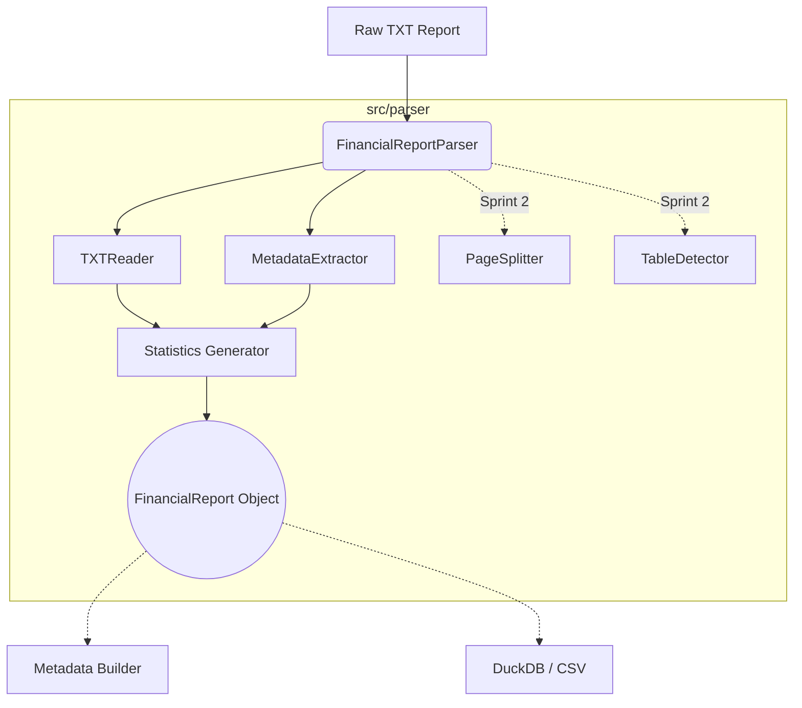

# Kiến Trúc Dataset Parser

Dataset Parser đóng vai trò nền tảng để đọc toàn bộ dữ liệu báo cáo tài chính dạng thô (TXT) và cấu trúc hoá thành các Object phục vụ cho các Pipeline phía sau của hệ thống AI. Kiến trúc được thiết kế dựa trên Clean Architecture, SOLID và Separation of Concerns (SoC).

## 1. Kiến trúc Hệ Thống (Architecture)

## 2. Các Thành Phần Chính

- **`FinancialReportParser` (Facade)**: Cung cấp API công khai duy nhất `report = parser.parse(path)`. Giấu đi toàn bộ độ phức tạp của việc đọc file, xử lý lỗi và trích xuất.
- **`TXTReader`**: Xử lý việc đọc file an toàn, fallback giữa các định dạng mã hoá (utf-8, cp1252) nhằm ngăn chặn ứng dụng bị crash do dữ liệu xấu.
- **`MetadataExtractor`**: Bóc tách ngữ nghĩa từ tên file hoặc cấu trúc thư mục (ví dụ: Công ty, Năm, Loại Báo Cáo).
- **`FinancialReport` (Entity)**: Data Object trung tâm chứa toàn bộ text gốc, metadata và statistic. Tất cả các Module chỉ tương tác qua object này, loại bỏ hoàn toàn việc truyền dict thiếu an toàn.

## 3. Quyết định Thiết Kế (Design Decisions)
- Không có quá trình xử lý text nặng (tách trang, dò bảng) trong Sprint 1. MVP chỉ tập trung vào framework và luồng chạy chuẩn.
- Các Error được quản lý đa cấp (Hierarchy) trong `exceptions.py`, cho phép bắt chính xác lỗi `DatasetNotFoundError` hay `EncodingError` thay vì bắt Exception chung chung.
- Tách riêng việc Logging ra file cấu hình độc lập `logger.py`, không sử dụng hàm `print()`.

## 4. Kế Hoạch Mở Rộng
- **Sprint 2**: Triển khai `PageSplitter` chia nội dung text thành từng trang dựa vào heuristic cụ thể, và `TableDetector` lấy ra vị trí các thẻ `<table>` HTML.
- **Sprint 3**: Tích hợp module xuất định dạng (Exporter) giúp lưu `FinancialReport` sang JSON hoặc CSV.
